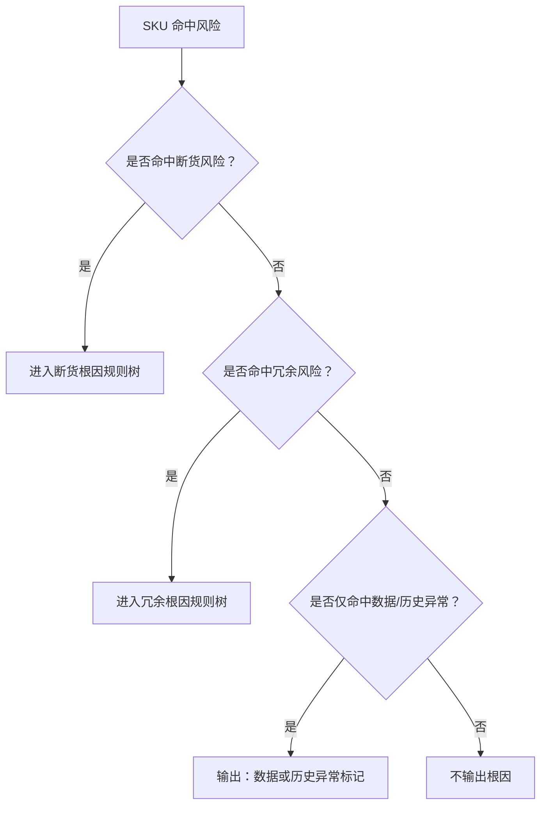
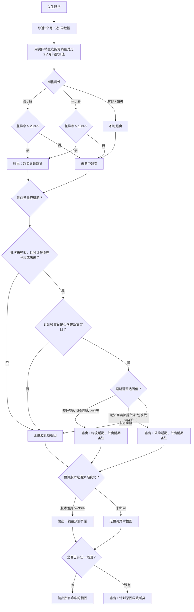
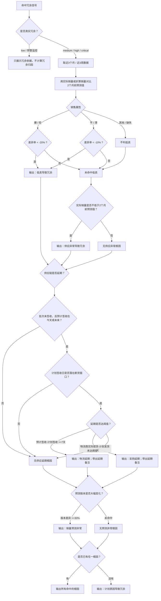
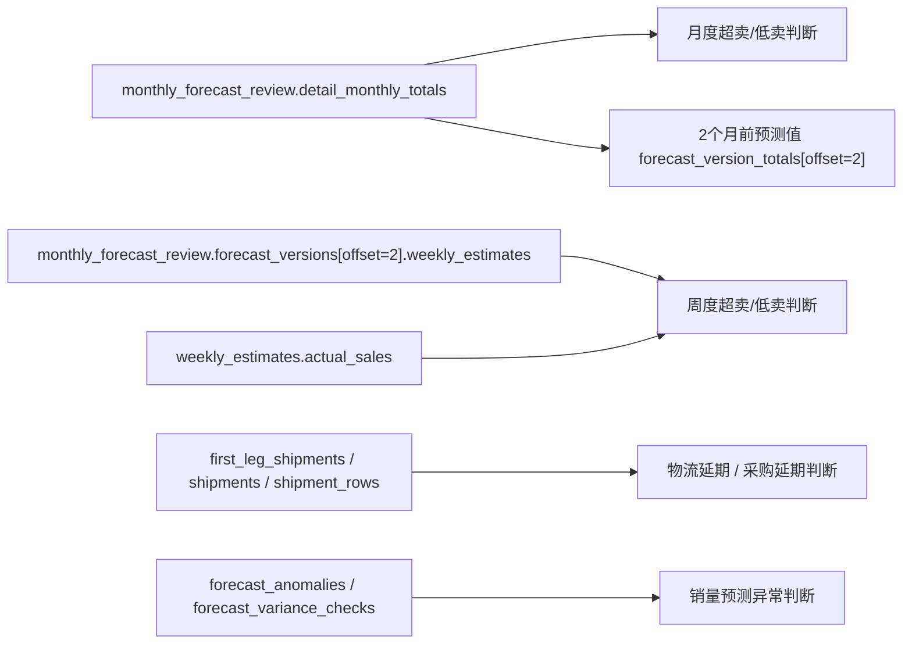

# 断货/冗余根因规则判断流程

本文档记录当前代码中的断货/冗余根因判断逻辑。根因不再使用旧兜底项，例如 `FBA前端可售不足`、`后端库存/长库龄冗余`、`有在途但未赶上断货窗口`。

## 总入口



## 阈值口径

| 判断项 | 口径 |
|---|---|
| 超卖/低卖对比基准 | 只对比 `2个月前的预测值` |
| 爆/旺超卖或低卖阈值 | 偏差必须大于 `20%`，`20%以内` 不算 |
| 平/滞超卖或低卖阈值 | 偏差必须大于 `10%`，`10%以内` 不算 |
| 月度销量预测异常 | 不同预测版本差异绝对值 `>=30%` |
| 周度销量波动异常 | 连续周实际销量偏离预估 `±20%` 以上，用于销售提示 |
| 冗余归因触发 | 仅 `medium/high/critical` 真实冗余进入冗余根因树；`low`/`预警监控` 只展示冗余依据，不计算冗余归因 |
| 物流延期 | 仅看未签收、预计签收日为今天或未来、计划签收日落在真实断货窗口内的批次；预计签收时间 - 计划签收时间 `>=7天` |
| 采购延期 | 仅看未签收、预计签收日为今天或未来、计划签收日落在真实断货窗口内的批次；物流商实际提货时间 - 计划发货时间 `>=4天` |

超卖/低卖差异率公式：

```text
差异率 = (实际销量或折算销量 - 2个月前预测值) / 2个月前预测值 * 100%
```

## 断货根因流程



断货会同时保留多个命中的根因，例如一个 SKU 可以同时输出：

```text
超卖导致断货
物流延期
采购延期
销量预测异常
```

只有当超卖、供应延期、销量预测异常都没有命中时，才输出：

```text
计划原因导致断货
```

## 冗余根因流程



只有当低卖、供应异常/延期、销量预测异常都没有命中时，才输出：

```text
计划原因导致冗余
```

## 数据来源关系



## 当前代码位置

| 逻辑 | 文件 |
|---|---|
| 根因规则入口 | `src/pmc_agent/sku_diagnosis.py` |
| 断货/冗余规则树 | `_rule_based_risk_causes` |
| 超卖/低卖阈值 | `_sales_gap_threshold_percent` |
| 2个月前预测值读取 | `_two_month_forecast_from_monthly_row`、`_two_month_forecast_weekly_rows` |
| 供应延期判断 | `_supply_delay_causes` |
| 预估异常判断 | `_forecast_change_cause` |
