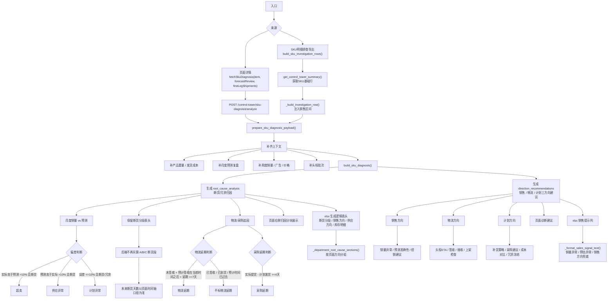

# SKU 建议动作生成流程

## 1. 入口

### 页面详情

- 前端调用 `fetchSkuDiagnosis(item, forecastReview, firstLegShipments)`
- 请求接口：`POST /control-tower/sku-diagnosis/analyze`

### SKU 明细排查 xlsx

- 后端调用 `build_sku_investigation_rows()`
- 先通过 `get_control_tower_summary()` 获取 SKU 基础行
- 再进入 `_build_investigation_row()`

## 2. 统一诊断准备

页面详情和 xlsx 导出都会进入：

`prepare_sku_diagnosis_payload()`

这个函数会补齐：

- 产品重量
- 发货成本
- 月度预测复盘
- 周度销量
- 广告数据
- 价格数据
- 头程批次
- 销售区间

## 3. 生成诊断

统一调用：

`build_sku_diagnosis()`

生成两类核心结果：

- `root_cause_analysis`
- `direction_recommendations`

## 4. 归因逻辑

### 月度销量 vs 预测

判断规则：

- 实际销量高于预测超过 10%，且断货：标记 `超卖`
- 预测高于实际销量超过 10%，且断货：标记 `供应异常`
- 误差不超过 10%，且断货或冗余：标记 `计划异常`
- 供应异常只在发生断货时溯源；冗余场景不输出供应异常。

### 预估异常

只看当前月目标下三版销量预估对当前月的预估量：

- 2 个月前预估线对当前月
- 1 个月前预估线对当前月
- 当前月预估线对当前月

只比较这三版预估量之间的差值和差异率，不和当前月实际销量或折算销量比较；其他月份不生成预估异常检查。

页面和 xlsx 只展示命中阈值的预估异常；未命中的检查仅保留在后端 `checks` 明细中，不作为提醒文案输出。

### 断货分段

`断货分段` 是页面和 xlsx 的固定分组表头，不再由后端单独生成 A段、B段、C段归因，避免与页面上方断货时间轴出现两套口径。

断货风险本身仍来自 `temp_lingxing_pici_sale.chazhi_0_N`；需要看未来哪几天断货时，以页面时间轴为准。

### 物流延期

只判断当前还没到货的批次：

- 未签收
- 预计签收时间在当前时间之后
- 预计签收时间 - 计划签收时间 >= 7天

满足才标记 `物流延期`。

已经签收、已经到货、预计时间已经过去的批次，不再标记物流延期。

### 采购延期

判断规则：

- 物流商实际提货时间 - 计划发货时间 >= 4天

满足则标记 `采购延期`。

## 5. 三方向建议

生成 `direction_recommendations`。

### 销售方向

包含：

- 销量异常
- 销量趋势
- 预测准确性
- 控销建议
- 广告/价格影响

销量异常文案使用日期区间，例如 `5月1日到5月7日`，不使用周编号。

### 物流方向

包含：

- 头程 ETA
- 签收
- 接收
- 上架
- 在途转化检查

### 计划方向

包含：

- 补货策略
- 采购建议
- 成本对比
- 冗余冻结
- 是否停止下采购单

## 6. 页面展示

页面右侧归因分块展示：

- 断货分段
- 销售方向
- 供应方向（含供应异常、物流/采购延期、计划异常）
- 库存明细
- 销售提示 / 触发信号

## 7. xlsx 输出

SKU 明细排查表现在和页面同源，导出表头保留基础 SKU 定位字段，生成逻辑只保留页面归因面板中的五列，不再输出建议动作列、归因 1-5 或证据 1-5。
导出文件会额外生成 `图表截图` sheet，用于嵌入详情页截图，如断货风险图和销量预估详情图。

### 根因拆解列

来源：

`root_cause_analysis`

通过部门方向重分组写入：

- 断货分段：保留表头；后端不写入自推 A/B/C 段
- 销售方向：`oversell`、`low_sell`、`sales_velocity`、`sales`、`forecast`、`forecast_ad`
- 供应方向：`supply_anomaly`、`logistics_delay`、`procurement_delay`、`logistics`、`planning_anomaly`、`plan`
- 库存明细：`inventory_position`、`inventory`、`stockout`、`overstock`

### 销售提示列

来源：

`direction_recommendations.sales`

写入控销提醒、销量异常、预估异常、控销提示和预测提示。控销提醒只读取 `stockout_and_sales_control` 已算好的 `stockout_window`、`control_segments`、`control_quantity`、`control_days`，不重新计算断货天数；爆/旺款按当前45天控销口径输出提醒文字。

## 8. 兜底逻辑

如果某个方向没有命中根因，xlsx 对应方向列留空；销售提示没有异常时，会兜底写入销售方向 summary。
